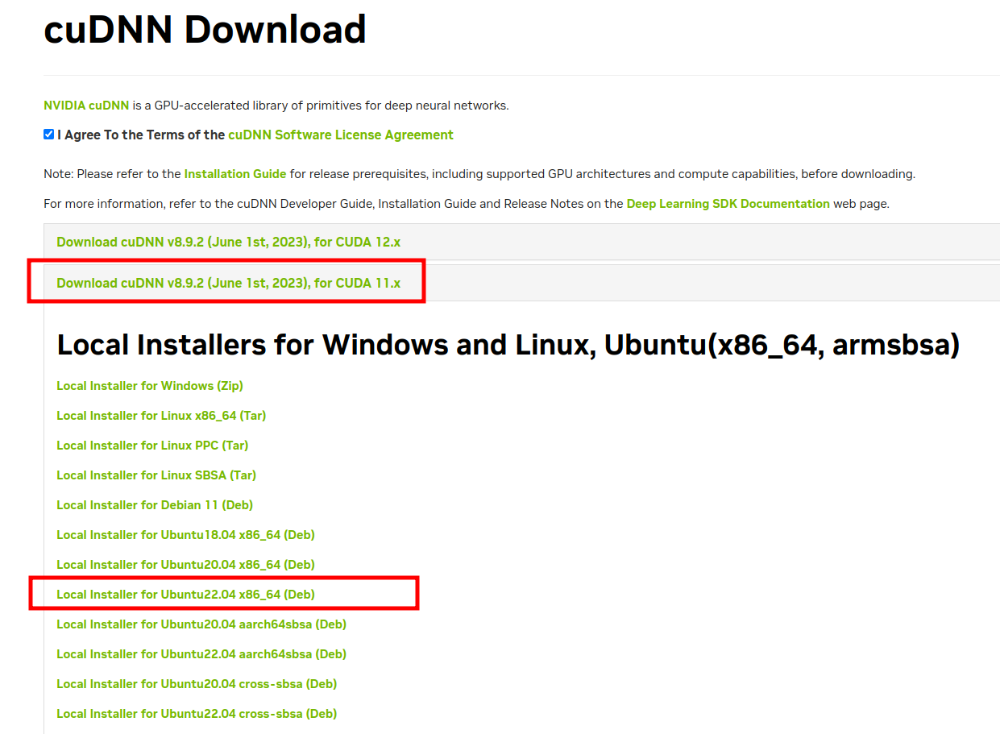

# GeForce GTX 1070 - Ubuntu 22.04 setup

This repository contains the needed instructions to install NVIDIA drivers and libraries:

- CUDA
- cuDNN

So that a Machine learning model can be developed and trained with [Tensorflow on the GPU](https://www.tensorflow.org/guide/gpu).

## Prerequisites

- Graphics: [NVIDIA Corporation GP104 GeForce GTX 1070](https://www.nvidia.com/en-gb/geforce/graphics-cards/geforce-gtx-1070/specifications/)
- OS: [Ubuntu 22.04.2 LTS](https://releases.ubuntu.com/jammy/)
- [Python3.8+](https://www.python.org/downloads/)
- [NVIDIA Developer programme account](https://developer.nvidia.com) 
- [CUDA 12.1](https://developer.nvidia.com/cuda-12-0-0-download-archive?target_os=Linux&target_arch=x86_64&Distribution=Ubuntu&target_version=22.04&target_type=deb_local)
- [cuDNN 8.9.2](https://developer.nvidia.com/cudnn)

## Setup & configuration

### Nvidia setup

Verify that Nvidia drivers are installed:

```shell
$ nvidia-smi
```

Output example:

```text
+---------------------------------------------------------------------------------------+
| NVIDIA-SMI 530.41.03              Driver Version: 530.41.03    CUDA Version: 12.1     |
|-----------------------------------------+----------------------+----------------------+
| GPU  Name                  Persistence-M| Bus-Id        Disp.A | Volatile Uncorr. ECC |
| Fan  Temp  Perf            Pwr:Usage/Cap|         Memory-Usage | GPU-Util  Compute M. |
|                                         |                      |               MIG M. |
|=========================================+======================+======================|
|   0  NVIDIA GeForce GTX 1070         Off| 00000000:0B:00.0  On |                  N/A |
| 11%   49C    P0               34W / 180W|   1080MiB /  8192MiB |      4%      Default |
|                                         |                      |                  N/A |
+-----------------------------------------+----------------------+----------------------+
                                                                                         
+---------------------------------------------------------------------------------------+
| Processes:                                                                            |
|  GPU   GI   CI        PID   Type   Process name                            GPU Memory |
|        ID   ID                                                             Usage      |
|=======================================================================================|
|    0   N/A  N/A      2123      G   /usr/lib/xorg/Xorg                          647MiB |
|    0   N/A  N/A      2294      G   /usr/bin/gnome-shell                        116MiB |
|    0   N/A  N/A     21442      G   ...sion,SpareRendererForSitePerProcess      160MiB |
|    0   N/A  N/A    124925      G   ...8698312,18086028496798649942,262144      148MiB |
|    0   N/A  N/A    157723      G   gnome-control-center                          2MiB |
+---------------------------------------------------------------------------------------+
```

## Check for driver updates

In above example output, versions installed at the time of writing:

- Driver version: `530.41.03`

<https://www.nvidia.com/download/driverResults.aspx/200481/en-us/>

- CUDA Version: `12.1`

### Look up latest drivers

<https://www.nvidia.com/download/driverResults.aspx/204837/en-us/>

At the time of writing this is:

```text
Version: 525.116.04
Release Date: 2023.5.9
```

Thus _current_ version is outdated:

```text
Version: 530.41.03
Release Date: 2023.3.23
```

_At the time of writing i chose to not update to the latest driver and continue with next steps_

### Compute Unified Device Architecture (CUDA) setup

CUDA is a parallel computing platform and application programming interface (API) that allows software to use certain types of graphics processing units (GPUs) for general purpose processing.
CUDA is a software layer that gives direct access to the GPU's virtual instruction set and parallel computational elements, for the execution of compute kernels

Install CUDA toolkit, select the correct version (that matches the CUDA version, see previous step):

<https://developer.nvidia.com/cuda-12-0-0-download-archive?target_os=Linux&target_arch=x86_64&Distribution=Ubuntu&target_version=22.04&target_type=deb_local>

```shell
$ wget https://developer.download.nvidia.com/compute/cuda/repos/ubuntu2204/x86_64/cuda-ubuntu2204.pin && \
sudo mv cuda-ubuntu2204.pin /etc/apt/preferences.d/cuda-repository-pin-600 && \
wget https://developer.download.nvidia.com/compute/cuda/12.0.0/local_installers/cuda-repo-ubuntu2204-12-0-local_12.0.0-525.60.13-1_amd64.deb && \
sudo dpkg -i cuda-repo-ubuntu2204-12-0-local_12.0.0-525.60.13-1_amd64.deb && \
sudo cp /var/cuda-repo-ubuntu2204-12-0-local/cuda-*-keyring.gpg /usr/share/keyrings/ && \
sudo apt-get update && sudo apt-get -y install cuda
```

Verify that CUDA is installed

```shell
$ nvcc --version
```

Output example:

```text
nvcc: NVIDIA (R) Cuda compiler driver
Copyright (c) 2005-2021 NVIDIA Corporation
Built on Thu_Nov_18_09:45:30_PST_2021
Cuda compilation tools, release 11.5, V11.5.119
Build cuda_11.5.r11.5/compiler.30672275_0
```

Take note of the _release_ version, at the time of writing, we will need this information for the CUDA installation in the next steps:

```text
11.5.119
```

#### Compile & and run CUDA C code example

This repo contains a CUDA script, [(source)](https://developer.nvidia.com/blog/easy-introduction-cuda-c-and-c/) to test and verify that Graphics card drives and CUDA is properly installed:

Use the CUDA C compiler to compile the [`hello.cu`](cuda/hello.cu) example:

```shell
$ nvcc -o cuda/hello cuda/hello.cu
```

It should compile _without any errors / warnings_

Now we can run the hello world code example:

```shell
$ ./cuda/hello
```

Expected output:

```text
Max error: 0.000000
```

If the output is as the same as the expected output we are good to go and means the CUDA libraries are properly working

### CUDA Deep Neural Network (cuDNN)

[NVIDIA cuDNN](https://developer.nvidia.com/cudnn) is a GPU-accelerated library of primitives for deep neural networks

#### Download cuDNN libary

In order to download the cuDNN library you need to register for a free account with the [NVIDIA Developer programme](https://developer.nvidia.com) in order to obtain the cuDDN library version _that is compatible with the CUDA version installed_ in the previous step.

Once logged in follow this [link](https://developer.nvidia.com/rdp/cudnn-download) to download cuDNN

Select the correct library version (that matches the CUDA installation version see previous step):

Here we use the _deb_ file to download:



But also the _tar_ file can be used so either download the _deb_ or the _Local Installer for Linux x86_64 (Tar)_

#### Install cuDNN Library

##### DEB

Install the downloaded _deb_ file:

```shell
$ sudo dpkg -i cudnn-local-repo-ubuntu2204-8.9.2.26_1.0-1_amd64.deb
```

##### Tarball

In case you have chosen to download the _tar_ file instead of the _deb_ file, unpack tarball:

```shell
$ tar xvf cudnn-linux-x86_64-8.9.2.26_cuda11-archive.tar.xz
```

Then when tarball has been unpacked, copy the libraries:

```shell
$ sudo cp cuda/include/cudnn.h /usr/lib/cuda/include/ && \
sudo cp cuda/lib64/libcudnn* /usr/lib/cuda/lib64/ && \
sudo chmod a+r /usr/lib/cuda/include/cudnn.h /usr/lib/cuda/lib64/libcudnn*
```

#### Post-installation configurations

We need to setup the needed `PATH` and `LD_LIBRARY_PATH` variables, before the CUDA Toolkit and Driver can be used. 
See also the [Post-installation actions guide](https://docs.nvidia.com/cuda/cuda-installation-guide-linux/index.html#post-installation-actions) for more information.

For bash:

```shell
$ echo 'export LD_LIBRARY_PATH=/usr/lib/cuda/lib64:$LD_LIBRARY_PATH' >> ~/.bashrc && \
echo 'export LD_LIBRARY_PATH=/usr/lib/cuda/include:$LD_LIBRARY_PATH' >> ~/.bashrc && \
source ~/.bashrc
```

For zsh:

```shell
$ echo 'export LD_LIBRARY_PATH=/usr/lib/cuda/lib64:$LD_LIBRARY_PATH' >> ~/.zshrc && \
echo 'export LD_LIBRARY_PATH=/usr/lib/cuda/include:$LD_LIBRARY_PATH' >> ~/.zshrc && \
source ~/.zshrc
```

### Create and activate virtual environment

Create and activate a virtual environment, from _root_ of project:

#### Venv

Create a virtual environment to install the needed packages:

```shell
$ python -m venv .venv && source .venv/bin/activate
$ pip install --upgrade pip
```

##### Install required packages

```shell
$ pip install -r requirements.txt
```

# Run GPU detection verification

## Notebook verification

Start Jupyter notebook:

```shell
$ jupyter notebook
```

Navigate to the _notebooks_ directory and open up [hello_world_tensorflow_gpu.ipynb](./notebooks/hello_world_tensorflow_gpu.ipynb) and run all

Finallly tensorflow should find the GPU and should result in:

- `/device:CPU:0`: The CPU of your machine.
- `/GPU:0`: Short-hand notation for the _first_ GPU of your machine that is visible to TensorFlow


```shell
import tensorflow as tf
tf.config.list_physical_devices('GPU')
```

Expected output:

```text
[PhysicalDevice(name='/physical_device:GPU:0', device_type: 'GPU')]
```

## Python module verification

From _root_ of project run:

```shell
python src/main.py
```

Expected output:

```text
[PhysicalDevice(name='/physical_device:GPU:0', device_type: 'GPU')]
```